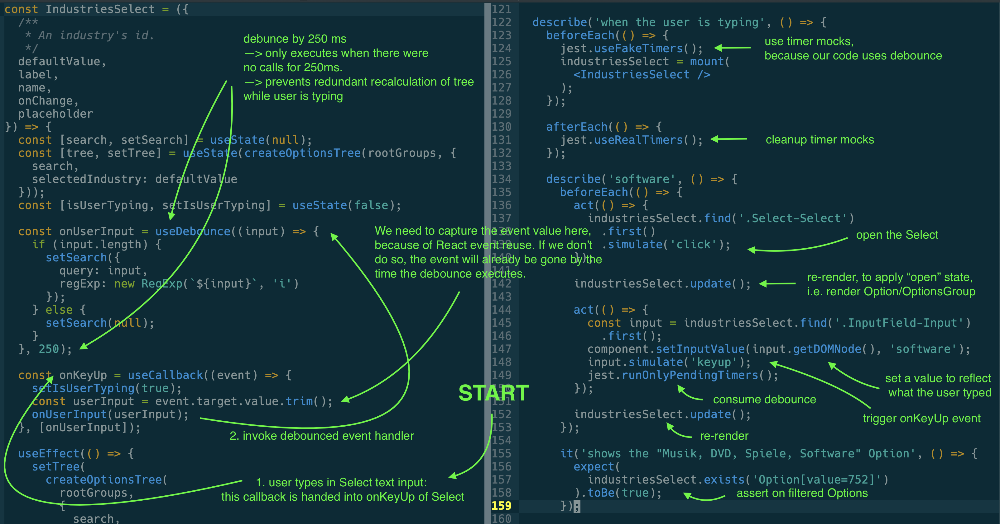

# JS Session: Testing

Testing React components.

In this JS Session we approach testing React Components. We address questions like

* What to test?
* How to test user interaction?
* How to test interactions with other components?
* How to test asynchronous interactions?

## [→ Slides](slides.pdf)

## → Testing debounced actions: filtering on key up

This example showcases filtering a tree of options based on user input. In order to not re-calculate the tree unneccessarily, we debounce tree recalculation by a certain time. Debouncing in this example means: _"Only recalculate the tree when there was no keyup event within 250 milliseconds"_.

The example project was bootstrapped with [Create React App](https://github.com/facebook/create-react-app). The usual `npm install`, `npm start`, `npm test` apply.
